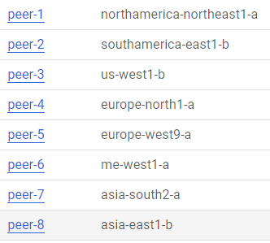
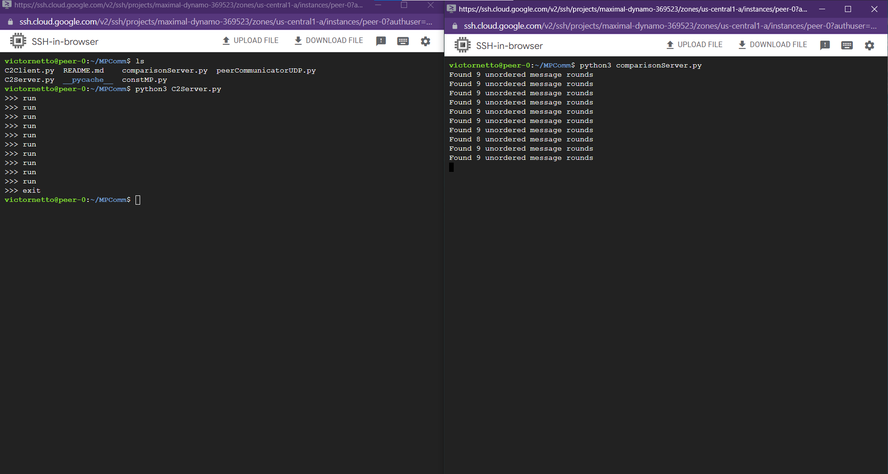
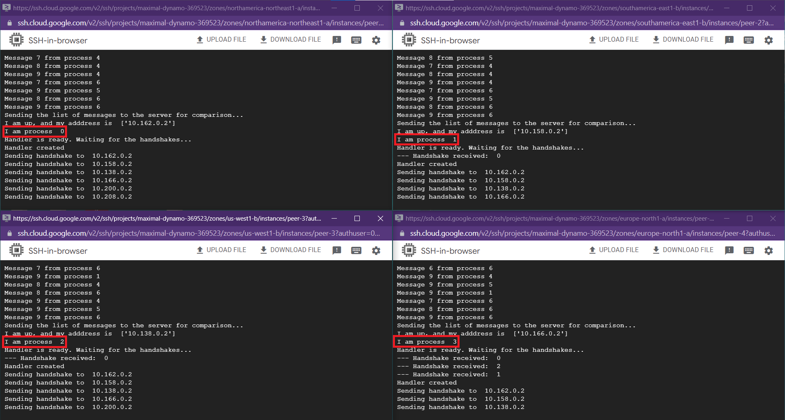
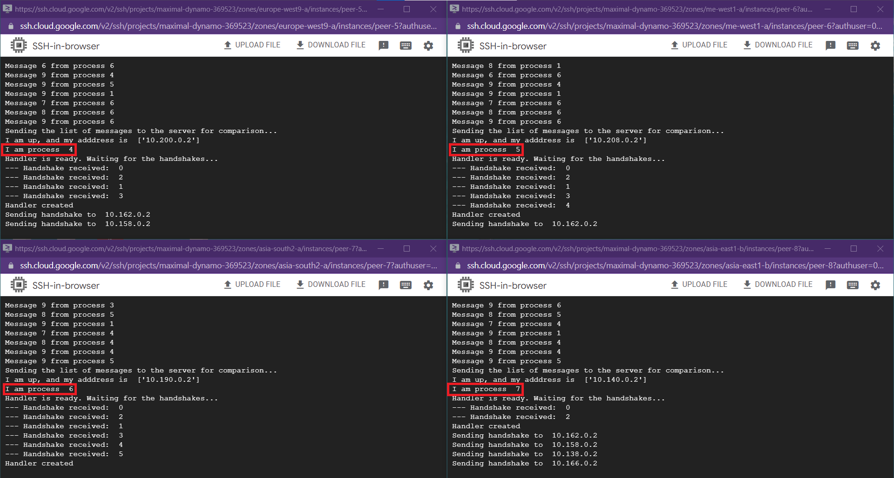

# MPComm - description
Very simple demo of multicast communication without coordination.
A set of peer processes is established and each process multicasts a sequence of messages to all other processes at random intervals. Messages are stamped with the ID of the sending process and a local sequence number defined by the sending process. This is a simple attempt to demonstrate the problem of message ordering (or, in this version, the lack of it).

The peer processes run the PeerCommunicatorUDP.py program, which has two separate threads, one for sending and the other for receiving messages. A basic handshaking protocol is used to synchronize the processes before they actually start multicasting the sequence of messages. Also, a fixed timer is set to allow plenty of time to start all processes on the participating machines. At the end, each process sends the sequence received messages to a server, which compares the sequences of messages received by all the processes to determine the number of messages received out of order (actually, the number of rounds in which at least one process received a different message form the others).

In order to actually see the problem, it is necessary to run the peer processes on different networks (e.g., run some of the processes in one region of the cloud, whereas the others are run on another region).

# Results

## Methodology
The peer communication without coordination was tested via multiple experiments with different number of **messages** and **peers**. The peers are in different **Zone** of the Google Cloud (see the section **Peers Zone Configuration** bellow). The comparison server are also in the Google Cloud.

To run multiple experiments, a simple **Command & Control (C2)** system was set up. The C2 Server was put in the same VM instance with the comparison server. From there, we start the comparison server and the C2 Server:
- The comparison server just wait for messages to be compared and display how many of then was out of order
- The C2 Server is in an infinite loop, wait for commands from the user. There is only 2 commands: `run N N_MSGS`, which make `N` peers to exchange `N_MSGS` messages; and `exit`, which just close the C2 Server and all C2 Clients.
Both servers, comparison and C2, are displayed in the section **C2 Server and Comparison Server** bellow.

Each peer have its own script of the C2 Client. From each peer VM the C2 Client is put to run and then waits for commands coming from the C2 Server. When the C2 Client receive the command `run N N_MSGS`, it run the *peerCommunicatorUDP.py* for that peer whenever that peer are in the set of the `N` first peers. The number of messages to be exchanged for that peer are `N_MSGS`. The image of the peer processes runing are show in the section **Peers** bellow. 

# Images
## Peers Zone Configuration

## C2 Server and Comparison Server

## Peers

